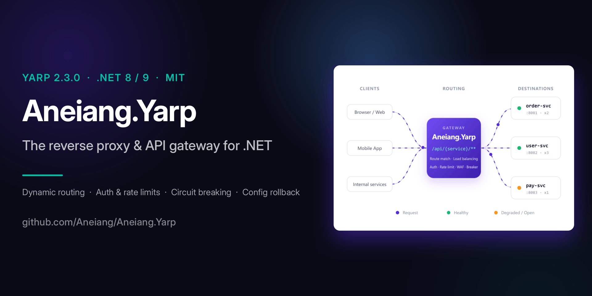

<div align="center">


<br/>


**Aneiang.Yarp — Full-featured API Gateway powered by YARP**

Plugin Architecture · Dashboard · Dynamic Routing · WAF · Service Discovery · AI Assistant · 2FA · IP Isolation

[](https://www.nuget.org/packages/Aneiang.Yarp)
[](https://www.nuget.org/packages/Aneiang.Yarp.Dashboard)
[](https://www.nuget.org/packages/Aneiang.Yarp.Client)
[](https://github.com/microsoft/reverse-proxy)
[](https://dotnet.microsoft.com/)
[](LICENSE)

[English](README.md) | [中文](README.zh-CN.md)

</div>

---

**Aneiang.Yarp** is a production-ready API gateway built on [Microsoft YARP](https://microsoft.github.io/reverse-proxy/) 2.3.0. It ships with everything you'd otherwise build yourself: a **plugin architecture** (11 built-in plugins), a visual **management dashboard**, WAF, AI assistant, multi-provider **service discovery**, notifications, health & circuit-breaker monitoring, and **one-line client auto-registration**.

[📖 Documentation](https://yarp.aneiang.com/docs/index.html#overview) · [🚀 Live Demo](https://yarp-test.aneiang.com/aneiang) `admin` / `demo123` 

---

## Aneiang.Yarp vs. Bare YARP

| Need | Bare YARP | Aneiang.Yarp |
|:-----|:----------|:-------------|
| Management UI | Build your own | ✅ Included |
| Edit config at runtime | Reload file only | ✅ CRUD + form/JSON editor + rollback + audit |
| Security (WAF) | None | ✅ WAF plugin (IP allow/deny, SQLi, XSS, path traversal) |
| Microservice registration | None | ✅ One-line REST/gRPC + heartbeat recovery |
| Observability | Logging only | ✅ Metrics, request logs, health, circuit-breaker panel |
| Service discovery | Manual clusters | ✅ Consul / Nacos / Eureka / K8s / HTTP-JSON / Static |
| AI assistant | None | ✅ Chat-based management (40 tools, read/write split) |
| Extensibility | Custom middleware | ✅ Drop-in `IGatewayPlugin` framework |

---

## Architecture

```
                   +-----------------------------------------------------------+
                   |                 Aneiang.Yarp Gateway (YARP 2.3.0)          |
 +-------------+   |   +------------------+  +-------------------------------+  |
 |  5+ clients  |   |   |  Web Dashboard   |  |  Management API + gRPC host   |  |
 |  (browsers/   |   |   |  Routes/Plugins  |  |  Client auto-registration     |  |
 |   apps)       |-->|   |  WAF / AI / 2FA  |  |                               |  |
 +-------------+   |   +--------+----------+  +--------------+----------------+  |
                   |            +------------------------------------------------+ |
                   |            |                                                  |
                   |   +--------v---------+                                    | |
                   |   |  Plugin Pipeline（11 built-in plugins）                     | |
                   |   |  WAF → RateLimit → Retry → CircuitBreaker →            | |
                   |   |  Compression → Cache → Metrics → ProxyLog              | |
                   |   +--------+---------+                                    | |
                   |            +------------------------------------------------+ |
                   |            |                                                  |
                   |   +--------v---------+   +-------------------------------+  |
                   |   |  YARP Reverse Proxy | → | Target services / clusters |  |
                   |   |  (dynamic routes)  |   |  (via Service Discovery)    |  |
                   |   +--------+---------+   +-------------------------------+  |
                   |            |
                   |   +--------v--------+
                   |   |  Storage: SQLite (SQLCipher AES-256) |
                   +-----------------------------------------------------------+
```

---

## Highlights

- **Plugin architecture** — everything is a plugin; 11 first-party plugins provide WAF, rate limiting, retry, circuit breaking, compression, caching, metrics and more. Bring your own `IGatewayPlugin` in minutes.
- **Visual dashboard** — clusters, routes, plugins, WAF, health, circuit breakers, logs, notifications, audit trail and config history in one place.
- **Runtime dynamic routing** — create / edit clusters & routes without restarting; auto-persists and auto-recovers on restart.
- **Native YARP config editing** — dual-mode **form + JSON** editor that works directly on the standard YARP schema.
- **Multi-provider service discovery** — Consul, Nacos, Eureka, Kubernetes, HTTP-JSON, Static.
- **One-line client registration** — microservices register on startup and unregister on shutdown over REST or gRPC, with heartbeat self-healing.
- **AI assistant** — manage the gateway by chat; 40 Function-Calling tools with a strict read/write permission split.
- **Flexible deployment** — `Auto` / `AllInOne` / `Split` / `ProxyOnly` / `DashboardOnly` with role-based endpoints.

---

## Quick Start

### Minimal

```bash
dotnet add package Aneiang.Yarp
dotnet add package Aneiang.Yarp.Dashboard
dotnet add package Aneiang.Yarp.Storage.Sqlite
```

```csharp
// Program.cs — Gateway
var builder = WebApplication.CreateBuilder(args);
builder.Services.AddAneiangYarp();
builder.Services.AddAneiangStorage();
builder.Services.AddAneiangYarpDashboard();

var app = builder.Build();
app.UseAneiangYarpDashboard();   // includes MapReverseProxy
app.Run();
```

Dashboard: `http://localhost:5000/apigateway`

**Microservice** — auto-registers on startup, no extra code:

```bash
dotnet add package Aneiang.Yarp.Client
```

```csharp
builder.Services.AddAneiangYarpClient();
```

```json
{ "Gateway": { "Registration": { "GatewayUrl": "http://localhost:5000" } } }
```

### Recommended (multi-port + gRPC + hot reload)

```csharp
var builder = WebApplication.CreateBuilder(args);
builder.UseYarpKestrelAutoConfig();           // multi-port / gRPC support
builder.Services.AddAneiangYarp();
builder.Services.AddAneiangStorage();
builder.Services.AddAneiangYarpDashboard();
builder.Services.AddAneiangYarpDeployment();  // deployment modes + health endpoints

var app = builder.Build();
app.UseAneiangYarpDashboard();
app.Run();
```

> Full step-by-step guide: [Quick Start](https://yarp.aneiang.com/docs/index.html#quickstart)

---

## Package Structure

| Package | Purpose | YARP |
|:--------|:--------|:---:|
| **Aneiang.Yarp** | Gateway core: dynamic routing, IP isolation, API auth, plugin execution | ✅ |
| **Aneiang.Yarp.Dashboard** | Web admin panel + AI assistant | via core |
| **Aneiang.Yarp.Client** | One-line auto-registration (no YARP dependency) | ❌ |
| **Aneiang.Yarp.Storage.Sqlite** | SQLite storage with SQLCipher AES-256 | via storage |
| **Aneiang.Yarp.Storage.Abstractions** | Storage interfaces & entities | ❌ |
| **Aneiang.Yarp.Grpc** | gRPC registration protocol | ❌ |
| **Aneiang.Yarp.Plugin.Abstractions** | Plugin contract (`IGatewayPlugin`) | ❌ |
| **Aneiang.Yarp.Plugin.\*** | 11 first-party plugins, pulled in individually | via core |

**.NET 8.0 / 9.0**.

---

## Feature Overview

| Area | What you get | Detail |
|:-----|:-------------|:-------|
| **Routing** | Dynamic clusters & routes, drag-sort priority, dual form/JSON editor, import/export, snapshot & rollback, audit log | [:link:](https://yarp.aneiang.com/docs/index.html#dynamic-routing) |
| **Authentication** | `None` / `DefaultJwt` / `CustomJwt` / `ApiKey` / custom delegate; TOTP **2FA** | [:link:](https://yarp.aneiang.com/docs/index.html#authentication) |
| **Security** | WAF: IP allow/deny, SQLi / XSS / path-traversal detection, request limits, security headers | [:link:](https://yarp.aneiang.com/docs/index.html#waf-firewall) |
| **Observability** | Request logs (TraceID pairing, sanitization, sampling), real-time WebSocket stream | [:link:](https://yarp.aneiang.com/docs/index.html#request-logs) |
| **Monitoring** | Request / latency / status metrics (P50/P90/P99), health checks, circuit-breaker panel | [:link:](https://yarp.aneiang.com/docs/index.html#health-check) |
| **Notification** | Webhook channels (DingTalk / HTTP), event rules with cooldown, delivery history | [:link:](https://yarp.aneiang.com/docs/index.html#notifications) |
| **AI Assistant** | Chat-based management, 40 tools, read/write permission split, streaming, multi-provider | [:link:](https://yarp.aneiang.com/docs/index.html#ai-assistant) |
| **IP Isolation** | Route requests to a specific developer's instance by client IP for collaborative debugging | [:link:](https://yarp.aneiang.com/docs/index.html#ip-isolation) |
| **Client SDK** | Auto-register / unregister, heartbeat recovery, `GetServicesAsync` / `UpdateDestinationsAsync` | [:link:](https://yarp.aneiang.com/docs/index.html#client-registration) |
| **Extensibility** | `IGatewayPlugin` contract, plugin-center management, hot-reconfigured bindings | [:link:](https://yarp.aneiang.com/docs/index.html#plugin-system) |
| **Config safety** | Auto-snapshot, rollback, `GET /api/config/apply-errors`, SQLCipher-encrypted store | [:link:](https://yarp.aneiang.com/docs/index.html#config-history) |

---

## Service Discovery

`ServiceDiscoveryRefreshService` periodically resolves a cluster's destinations from a registry and publishes a new YARP snapshot — no restart. Bound per cluster (`service-discovery` plugin binding).

| Mode | Notes |
|:-----|:------|
| `Static` | Fixed endpoint list |
| `HttpJson` | Generic HTTP endpoint returning JSON endpoints |
| `Consul` | Healthy-instance filtering |
| `Nacos` | `healthyOnly` filter + `hosts` resolution |
| `Eureka` | JSON + `port.$` parsing + `UP` filtering |
| `Kubernetes` | ServiceAccount token + endpoints subsets |

Config: `Mode` (default `Static`), `Endpoint`, `ServiceName`, `Namespace` (`default`), `Scheme` (`http`), `RefreshSeconds` (`30`), `RequestTimeoutSeconds` (`5`).

---

## Built-in Plugins

| ID | Scope | What it does |
|:---|:------|:-------------|
| `waf` | Route | IP allow/deny, SQLi / XSS / path-traversal detection, request limits, security headers |
| `rate-limit` | Route | FixedWindow / SlidingWindow / TokenBucket / Concurrency |
| `rate-limit-redis` | Route | Distributed limiting via Redis Lua; 429 with `Retry-After` / `X-RateLimit-*` |
| `request-retry` | Route | Retry with exponential backoff + jitter, status/exception policy |
| `circuit-breaker` | Cluster | Failure threshold, recovery timeout, half-open probing |
| `compression` | Route | Gzip / Brotli by MIME allowlist + min size |
| `response-cache` | Route | Bounded in-memory cache with TTL & vary key |
| `traffic-metrics` | Route | Per-route requests / errors / latency / bytes |
| `cluster-metrics` | Cluster | Per-cluster requests / errors / latency / destinations |
| `proxy-log` | Route | Full proxy capture (headers / optional body), sampling |
| `service-discovery` | Cluster | Periodic registry-backed endpoint refresh |

---

## Documentation

Full documentation lives at **[yarp.aneiang.com](https://yarp.aneiang.com)**.

- **Getting Started** — [Overview](https://yarp.aneiang.com/docs/index.html#overview) · [Quick Start](https://yarp.aneiang.com/docs/index.html#quickstart)
- **Gateway Core** — [Authentication](https://yarp.aneiang.com/docs/index.html#authentication) · [Dynamic Routing](https://yarp.aneiang.com/docs/index.html#dynamic-routing) · [IP Isolation](https://yarp.aneiang.com/docs/index.html#ip-isolation) · [Configuration Reference](https://yarp.aneiang.com/docs/index.html#configuration)
- **Dashboard** — [Dashboard Overview](https://yarp.aneiang.com/docs/index.html#dashboard-overview) · [Config History](https://yarp.aneiang.com/docs/index.html#config-history)
- **Security** — [WAF Firewall](https://yarp.aneiang.com/docs/index.html#waf-firewall) · [Policy Management](https://yarp.aneiang.com/docs/index.html#policy-management)
- **Monitoring** — [Health Check](https://yarp.aneiang.com/docs/index.html#health-check) · [Circuit Breaker](https://yarp.aneiang.com/docs/index.html#circuit-breaker) · [Rate Limiting](https://yarp.aneiang.com/docs/index.html#rate-limiting) · [Request Logs](https://yarp.aneiang.com/docs/index.html#request-logs) · [Request Retry](https://yarp.aneiang.com/docs/index.html#request-retry) · [Notifications](https://yarp.aneiang.com/docs/index.html#notifications)
- **Plugins & Pipeline** — [Plugin System](https://yarp.aneiang.com/docs/index.html#plugin-system) · [Middleware Pipeline](https://yarp.aneiang.com/docs/index.html#middleware-pipeline)
- **Client SDK** — [Client Registration](https://yarp.aneiang.com/docs/index.html#client-registration)
- **AI Assistant** — [AI Assistant](https://yarp.aneiang.com/docs/index.html#ai-assistant)
- **Advanced** — [Deployment Modes](https://yarp.aneiang.com/docs/index.html#deployment-modes) · [Custom Auth](https://yarp.aneiang.com/docs/index.html#custom-auth) · [Production Config](https://yarp.aneiang.com/docs/index.html#production-config)
- **Storage** — [SQLite Storage](https://yarp.aneiang.com/docs/index.html#storage-sqlite)

---

## Contributing

We welcome contributions!

1. Fork the repo and create a feature branch (`git checkout -b feature/your-feature`).
2. Commit with a clear message describing the change and its purpose.
3. Keep the **API surface stable** — new features should ideally be added as plugins.
4. For new plugins, follow the `IGatewayPlugin` manifest conventions (id, display name, version, scope, capabilities) and provide a JSON Schema.
5. When changing Dashboard strings, update both `zh-CN` and `en-US` language packs.
6. Build the solution with **0 warnings / 0 errors** before submitting a Pull Request.

Report bugs and feature requests via GitHub Issues. All first-party packages are MIT-licensed.

---

## NuGet

| Package | NuGet |
|:--------|:-----:|
| **Aneiang.Yarp** | [](https://www.nuget.org/packages/Aneiang.Yarp) |
| **Aneiang.Yarp.Dashboard** | [](https://www.nuget.org/packages/Aneiang.Yarp.Dashboard) |
| **Aneiang.Yarp.Client** | [](https://www.nuget.org/packages/Aneiang.Yarp.Client) |
| **Aneiang.Yarp.Storage.Abstractions** | [](https://www.nuget.org/packages/Aneiang.Yarp.Storage.Abstractions) |
| **Aneiang.Yarp.Storage.Sqlite** | [](https://www.nuget.org/packages/Aneiang.Yarp.Storage.Sqlite) |
| **Aneiang.Yarp.Grpc** | [](https://www.nuget.org/packages/Aneiang.Yarp.Grpc) |
| **Aneiang.Yarp.Plugin.Abstractions** | [](https://www.nuget.org/packages/Aneiang.Yarp.Plugin.Abstractions) |

**.NET 8.0 / 9.0** · **YARP 2.3.0**

---

## License

[MIT](LICENSE)

---

<div align="center" style="display: flex; justify-content: center; align-items: center; gap: 20px;
            background: #f6f8fa; padding: 20px 30px; border-radius: 12px;
            border: 1px solid #e1e4e8; box-shadow: 0 2px 8px rgba(0,0,0,0.05);">
  
  <div style="text-align: left;">
    <h3 style="margin: 0 0 4px 0; font-size: 22px; font-weight: 600; color: #24292e;">
      递归不爆炸
    </h3>
    <p style="margin: 0; font-size: 16px; color: #586069; max-width: 280px;">
      Scan to follow and get more great content
    </p>
  </div>
</div>

<div align="center">

If this project helps you, [⭐ Star it](https://github.com/aneiang/Aneiang.Yarp) to support development

</div>