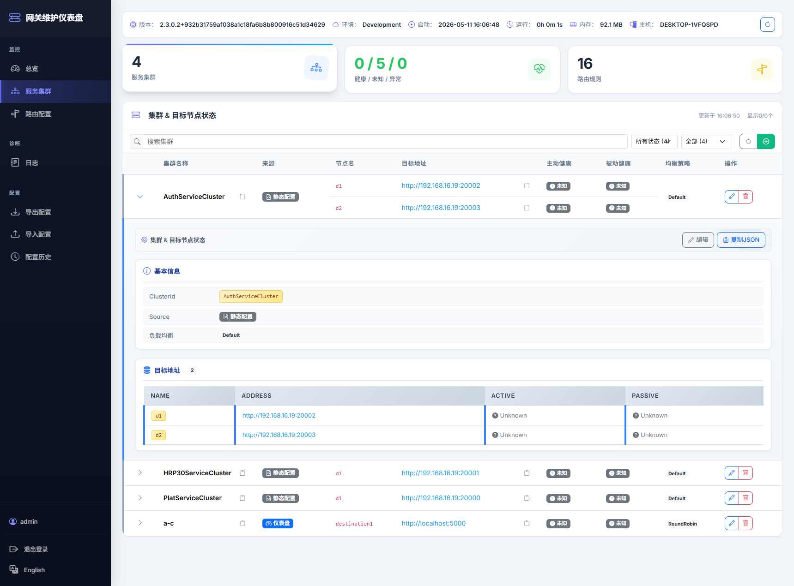
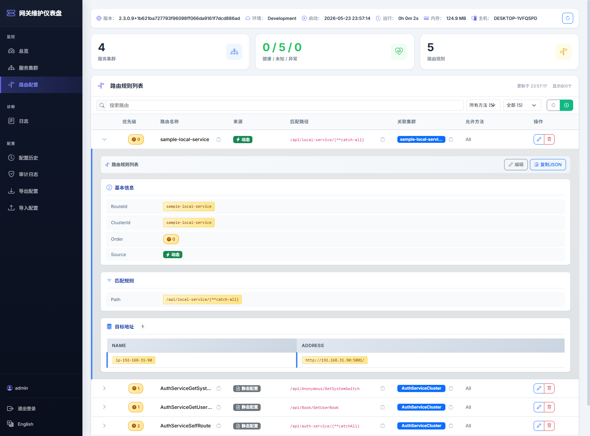
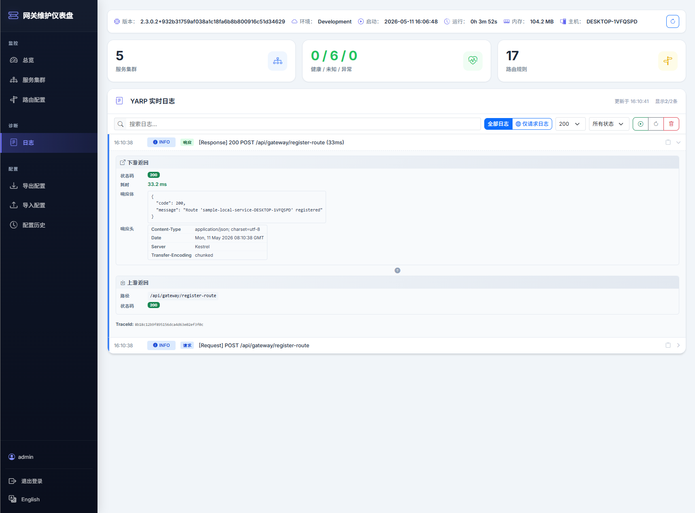

# Aneiang.Yarp

<div align="center">

**基于 .NET 的动态路由网关管理库**

[](https://www.nuget.org/packages/Aneiang.Yarp)
[](https://www.nuget.org/packages/Aneiang.Yarp)
[](LICENSE)
[](https://github.com/microsoft/reverse-proxy)
[](https://dotnet.microsoft.com/)

[English](README.md) | [中文](README.zh-CN.md)

</div>

---

基于 [Microsoft YARP](https://github.com/microsoft/reverse-proxy) 构建的强大**动态路由网关管理库**，提供运行时路由注册、服务自动发现、实时监控仪表盘，同时完整保留 YARP 反向代理的全部能力。

## 📦 项目架构：两个独立的 NuGet 包

Aneiang.Yarp 采用**模块化设计**，核心功能与仪表盘完全解耦：

```
┌─────────────────────────────────────────────────┐
│           Aneiang.Yarp.Dashboard                 │
│      （可选安装：监控运维界面）                    │
│  • 集群/路由可视化查看                            │
│  • 实时请求日志捕获                               │
│  • JWT 登录认证                                   │
└─────────────────────────────────────────────────┘
                        ▲
                        │ 可选依赖
                        │
┌─────────────────────────────────────────────────┐
│              Aneiang.Yarp (核心库)               │
│         （独立使用：动态网关核心能力）             │
│  • 动态路由 API                                  │
│  • 自动注册客户端                                 │
│  • YARP 反向代理增强                              │
└─────────────────────────────────────────────────┘
```

**核心设计理念：**
- ✅ **Aneiang.Yarp 可独立使用**：不依赖 Dashboard 也能完整运行
- ✅ **Dashboard 是可选插件**：安装后即插即用，不安装不影响核心功能
- ✅ **按需组合**：根据你的场景自由选择

---

## 🎯 核心库：Aneiang.Yarp

**Aneiang.Yarp** 是项目的核心库，提供完整的动态网关管理能力，**可以完全不依赖 Dashboard 独立运行**。

### 核心特性

| 特性 | 说明 |
|------|------|
| 🚀 **动态路由** | REST API 支持运行时注册/更新/注销路由 |
| 🔄 **自动注册** | 服务启动自动注册、关闭自动注销 — **仅需一行代码** |
| 👥 **实例隔离** | 多人调试时自动隔离路由命名空间，互不干扰 |
| 🧠 **智能默认值** | 自动获取程序集名、Kestrel 地址，localhost 自动解析为内网 IP |
| 🛡️ **API 授权** | 可选的 BasicAuth/ApiKey 保护注册 API |
| 🚪 **条件化 API 暴露** | 通过 `enableRegistration` 参数启用/禁用注册 API |

### 快速开始（仅核心库）

```csharp
// Program.cs
using Aneiang.Yarp.Extensions;

var builder = WebApplication.CreateBuilder(args);

// ⭐ 一行搭建网关（不依赖 Dashboard）
builder.Services.AddAneiangYarp();

var app = builder.Build();
app.MapReverseProxy();
app.Run();
```

---

## 🌟 可选插件：Aneiang.Yarp.Dashboard

**Aneiang.Yarp.Dashboard** 是**主推产品**，提供功能完善的监控运维界面。**它是可选的——安装后获得完整可视化管理能力，不安装则保持轻量级部署。**

### 核心特性

| 特性 | 说明 |
|------|------|
| 📊 **集群状态** | 实时查看所有服务集群和健康检查信息 |
| 🛣️ **路由管理** | 可视化查看路由规则，支持展开查看完整配置详情 |
| 📝 **实时日志** | 捕获 YARP 转发日志和请求/响应详情 |
| 🔐 **多模式认证** | JWT 登录、API Key 或自定义委托认证 |
| 🌐 **国际化支持** | 运行时语言切换：中文 / 英文 |

### 启用仪表盘

```csharp
// Program.cs
using Aneiang.Yarp.Extensions;
using Aneiang.Yarp.Dashboard.Extensions;

var builder = WebApplication.CreateBuilder(args);

// 启用网关核心功能
builder.Services.AddAneiangYarp();

// 启用监控仪表盘（可选）
builder.Services.AddAneiangYarpDashboard();

var app = builder.Build();
app.UseRouting();
app.MapControllers();
app.MapReverseProxy();
app.Run();
```

访问仪表盘：`http://localhost:5000/apigateway`
---

## 🚀 客户端服务：自动注册

> **注意**：自动注册功能需要客户端服务与网关之间网络互通。此功能主要为**开发和调试场景**设计。

```csharp
// Program.cs
using Aneiang.Yarp.Extensions;

var builder = WebApplication.CreateBuilder(args);

// ⭐ 一行搞定：启动自动注册 → 关闭自动注销
builder.Services.AddAneiangYarpClient();

builder.Services.AddControllers();

var app = builder.Build();
app.UseRouting();
app.MapControllers();
app.Run();
```

**`appsettings.json`**（最小配置）：

```json
{
  "Gateway": {
    "Registration": {
      "GatewayUrl": "http://192.168.1.100:5000"
    }
  }
}
```

就这么简单！服务启动时会自动注册到网关，关闭时自动注销。

---

## 📦 NuGet 包

| 包名 | 说明 | 是否独立 | 链接 |
|------|------|----------|------|
| **Aneiang.Yarp** | 基础库：动态路由 + 自动注册客户端 | ✅ 是 | [](https://www.nuget.org/packages/Aneiang.Yarp) |
| **Aneiang.Yarp.Dashboard** | 🌟 **主推产品**：监控运维仪表盘 | ❌ 依赖核心库 | [](https://www.nuget.org/packages/Aneiang.Yarp.Dashboard) |

**环境要求：**
- 目标框架：`.NET 8.0` / `.NET 9.0`
- YARP 版本：`2.3.0`

---

## 📸 仪表盘截图

### 集群状态



### 路由配置



### 日志查看



---

## ⚡ 高级用法

<details>
<summary><b>🔗 多级网关链</b></summary>

```csharp
// 内网网关同时注册到外网网关
builder.Services.AddAneiangYarp();
builder.Services.AddAneiangYarpClient(o =>
{
    o.GatewayUrl = "http://outer-gateway:5000";
});
```

</details>

<details>
<summary><b>🛡️ 网关 API 授权保护（可选）</b></summary>

> **重要提示**：`AddGatewayApiAuth()` 是**可选的**。不调用时，注册 API 默认公开访问。

**何时使用：**
- ✅ **调用它**：生产环境、公网暴露、需要访问控制
- ❌ **跳过它**：本地开发、内网隔离（网络层面已保护）

```csharp
// 方式一：从 Dashboard 配置自动检测（推荐）
builder.Services.AddGatewayApiAuth();

// 方式二：显式配置
builder.Services.AddGatewayApiAuth(o =>
{
    o.Mode = GatewayApiAuthMode.BasicAuth;
    o.Username = "admin";
    o.Password = "admin@2026";
});
```

配置文件方式：
```json
{
  "Gateway": {
    "ApiAuth": {
      "Mode": "BasicAuth",
      "Username": "admin",
      "Password": "admin@2026"
    }
  }
}
```

**配置优先级**（后面的覆盖前面的）：
1. `Gateway:ApiAuth` 配置节
2. 从 `Gateway:Dashboard` 自动检测（如果 Dashboard 配置了 JWT 密码）
3. `configureOptions` 回调（最高优先级）

**自动检测逻辑：**
当调用 `AddGatewayApiAuth()` 未显式配置时：
- 如果存在 `Gateway:Dashboard:JwtPassword` → 自动使用 BasicAuth，用户名 `admin`，密码来自 `JwtPassword`
- 这使得在配置了 Dashboard 认证时，客户端自动注册可以实现零配置

</details>

<details>
<summary><b>🔐 自动注册授权配置（三种场景）</b></summary>

客户端自动注册到网关时，认证可以通过三种方式配置：

| 场景 | 网关配置 | 客户端配置 | 说明 |
|------|----------|------------|------|
| **场景 1：单独使用 Aneiang.Yarp** | 显式配置 API 认证 | 手动配置认证凭据 | 需要显式配置 |
| **场景 2：Dashboard（已启用认证）** | Dashboard 配置了 JWT/ApiKey | **自动读取** Dashboard 配置 | **零配置**（推荐） |
| **场景 3：Dashboard（未启用认证）** | 未配置认证 | 无需配置 | 仅限本地开发 |

**场景 2 示例（推荐）：**
```json
// 网关 appsettings.json
{
  "Gateway": {
    "Dashboard": {
      "AuthMode": "DefaultJwt",
      "JwtPassword": "your-strong-password"
    }
  }
}
```

```csharp
// 网关 Program.cs
builder.Services.AddAneiangYarp();
builder.Services.AddAneiangYarpDashboard();
builder.Services.AddGatewayApiAuth();  // 自动读取 Dashboard 配置

// 客户端 Program.cs - 完全零配置！
builder.Services.AddAneiangYarpClient();
```

</details>

<details>
<summary><b>👥 实例隔离（多人协作）</b></summary>

**默认已开启** — 自动将机器标识嵌入路由：

| 维度 | 开发者 A (PC-JOHN) | 开发者 B (PC-JANE) |
|------|-------------------|-------------------|
| routeName | `my-service-PC-JOHN` | `my-service-PC-JANE` |
| matchPath | `/PC-JOHN/api/{**catch-all}` | `/PC-JANE/api/{**catch-all}` |

**特殊处理：**
- 自动检测机器名称作为实例 ID
- 防止多个开发者同时测试同一网关时的路由冲突
- 实例前缀在转发到下游服务时会被剥离

自定义实例 ID：
```csharp
builder.Services.AddAneiangYarpClient(options =>
{
    options.InstanceId = "dev-john";
    options.InstancePrefixFormat = "dev-{instanceId}";
});
```

如不需要可关闭：
```csharp
options.InstanceIsolation = false;
```

</details>

<details>
<summary><b>🌐 内网 IP 自动解析</b></summary>

当 `DestinationAddress` 包含 `localhost` / `127.0.0.1` / `0.0.0.0` 时：

```
配置值:   http://localhost:5001
解析后:   http://192.168.1.101:5001  （内网 IP）
```

**特殊处理：**
- 自动检测本地回环地址
- 解析为第一个可用的内网 IP，支持跨机器访问
- 对自动注册至关重要：其他机器能够访问该服务

关闭：`AutoResolveIp = false`

</details>

<details>
<summary><b>🚪 条件化 API 暴露（enableRegistration）</b></summary>

控制网关是否暴露动态路由注册 API：

```csharp
// 启用注册 API（默认）
builder.Services.AddAneiangYarp(enableRegistration: true);

// 禁用注册 API（安全加固）
builder.Services.AddAneiangYarp(enableRegistration: false);
```

**特殊处理：**
- 当 `enableRegistration = false` 时，`GatewayConfigController` 会从 MVC 应用模型中完全移除
- 返回 **404 Not Found**（不是 401/403）—— 端点根本不存在
- 推荐用于不应接受外部路由变更的生产网关
- 不影响 YARP 代理功能或 Dashboard 访问

</details>

<details>
<summary><b>🔧 自定义中间件管道</b></summary>

```csharp
var app = builder.Build();

app.UseAuthentication();
app.UseAuthorization();
app.UseRequestLogging();
app.UseRateLimiter();

app.UseRouting();
app.MapControllers();
app.MapReverseProxy();  // 必须放最后
```

</details>

---

## 📖 配置参考

<details>
<summary><b>Gateway:Registration</b> — 完整配置选项</summary>

```json
{
  "Gateway": {
    "Registration": {
      "GatewayUrl": "http://192.168.1.100:5000",
      "RouteName": "my-service",
      "ClusterName": "my-service-cluster",
      "MatchPath": "/api/my-service/{**catch-all}",
      "DestinationAddress": "http://localhost:5001",
      "Order": 50,
      "AutoResolveIp": true,
      "TimeoutSeconds": 10,
      "InstanceIsolation": true,
      "InstanceId": "john",
      "InstancePrefixFormat": "{instanceId}",
      "StripInstancePrefix": true,
      "DownstreamPathPrefix": null,
      "Transforms": [],
      "AuthToken": null,
      "ApiKey": null,
      "BasicAuthUsername": null,
      "BasicAuthPassword": null
    }
  }
}
```

**配置优先级：** 代码 `options => {}` > 环境变量 > `appsettings.json`

</details>

<details>
<summary><b>Gateway:Dashboard</b> — 仪表盘配置</summary>

```json
{
  "Gateway": {
    "Dashboard": {
      "EnableProxyLogging": true,
      "AuthMode": "DefaultJwt",
      "JwtPassword": "demo123",
      "RoutePrefix": "apigateway",
      "Locale": "zh-CN"
    }
  }
}
```

**鉴权模式：** `None` | `ApiKey` | `CustomJwt` | `DefaultJwt`

**特殊处理：**
- JWT 令牌默认有效期 **8 小时**
- 通过 `POST /apigateway/login` 获取令牌
- 当配置了 `AuthMode` 时，`AddGatewayApiAuth()` 可以自动从 `JwtPassword` 检测凭据
- `RoutePrefix` 允许自定义仪表盘 URL 路径（默认：`apigateway`）
- `Locale` 支持运行时语言切换：`en-US` | `zh-CN`

</details>

<details>
<summary><b>ReverseProxy</b> — 标准 YARP 配置</summary>

```json
{
  "ReverseProxy": {
    "Routes": {
      "my-route": {
        "ClusterId": "my-cluster",
        "Match": "/api/test/{**catch-all}"
      }
    },
    "Clusters": {
      "my-cluster": {
        "Destinations": {
          "d1": { "Address": "http://localhost:5000/" }
        },
        "LoadBalancingPolicy": "PowerOfTwoChoices"
      }
    }
  }
}
```

详见 [YARP 官方文档](https://microsoft.github.io/reverse-proxy/articles/config-files.html)。

</details>

---

## 🔌 API 端点

<details>
<summary><b>网关 API</b> — <code>/api/gateway</code></summary>

| 端点 | 方法 | 说明 |
|------|------|------|
| `/api/gateway/register-route` | `POST` | 注册/更新路由 |
| `/api/gateway/{routeName}` | `DELETE` | 注销路由 |
| `/api/gateway/routes` | `GET` | 查询所有路由 |
| `/api/gateway/ping` | `GET` | 健康检查 |

**请求示例：**
```json
{
  "routeName": "my-service",
  "clusterName": "my-service-cluster",
  "matchPath": "/api/my-service/{**catch-all}",
  "destinationAddress": "http://192.168.1.101:5001",
  "order": 50,
  "transforms": [
    { "PathSet": "/api/backend/{**catch-all}" }
  ]
}
```

**响应格式：**
```json
{ "code": 200, "message": "路由注册成功" }
```

</details>

<details>
<summary><b>仪表盘 API</b> — <code>/apigateway</code></summary>

| 端点 | 说明 |
|------|------|
| `GET /apigateway` | 仪表盘首页 |
| `GET /apigateway/login` | 登录页面 |
| `POST /apigateway/login` | 登录接口（返回 JWT 令牌） |
| `GET /apigateway/info` | 网关运行信息 |
| `GET /apigateway/clusters` | 集群状态 |
| `GET /apigateway/routes` | 路由配置 |
| `GET /apigateway/routes/{routeId}` | 路由详情 |
| `GET /apigateway/logs` | 最近 YARP 日志 |
| `DELETE /apigateway/logs` | 清空日志 |

</details>

---

## 📂 项目结构

```
Aneiang.Yarp/
├── src/
│   ├── Aneiang.Yarp/                  # 基础库
│   │   ├── Controllers/               # 网关 REST API
│   │   ├── Extensions/                # DI 注册扩展
│   │   ├── Models/                    # 数据模型和配置选项
│   │   └── Services/                  # 核心服务
│   │
│   └── Aneiang.Yarp.Dashboard/        # 仪表盘库
│       ├── Controllers/               # 仪表盘 API
│       ├── Views/                     # Razor 视图
│       ├── Services/                  # 仪表盘服务
│       ├── Models/                    # 仪表盘模型
│       └── Extensions/                # DI 注册扩展
│
└── samples/
    ├── SampleGateway/                 # 网关示例
    └── SampleLocalService/            # 客户端示例
```

---

## 🧪 示例项目

```bash
# 终端 1：启动网关
dotnet run --project samples/SampleGateway

# 终端 2：启动本地服务（自动注册）
dotnet run --project samples/SampleLocalService

# 测试路由
curl http://localhost:5000/api/your-endpoint
```

**示例网关特性：**
- 仪表盘访问 `/apigateway`（登录：`admin` / `demo123`）
- Serilog 日志
- JWT 认证

---

## 📄 许可证

本项目采用 [MIT 许可证](LICENSE)。

---

<div align="center">

**为 .NET 社区用心打造 ❤️**

如果觉得有用，请 [⭐ 给个 Star](https://github.com/aneiang/Aneiang.Yarp)！

</div>
