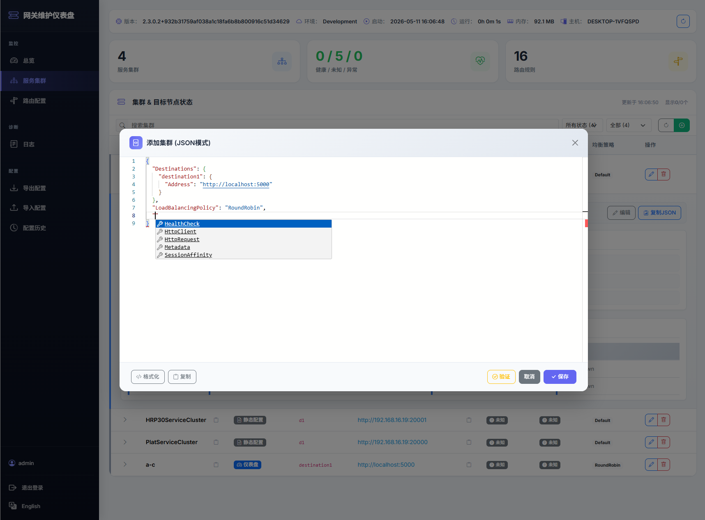
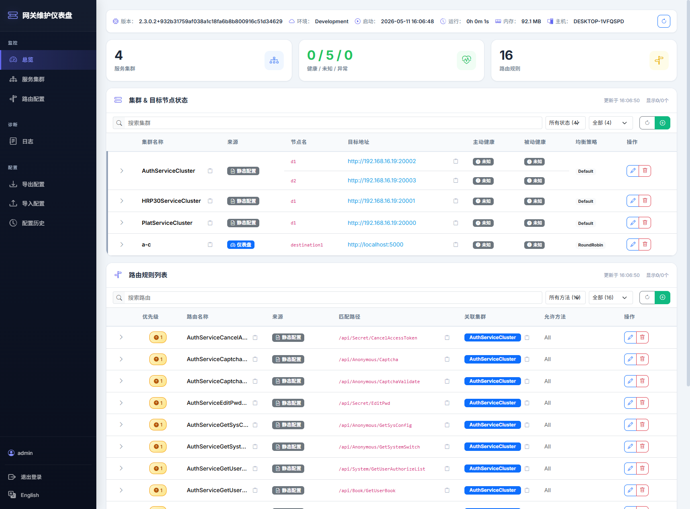

# Aneiang.Yarp.Dashboard

<div align="center">

**给 YARP 网关装上管理后台，只需 3 行代码**

[](https://www.nuget.org/packages/Aneiang.Yarp.Dashboard)
[](https://www.nuget.org/packages/Aneiang.Yarp.Dashboard)
[](https://github.com/microsoft/reverse-proxy)
[](https://dotnet.microsoft.com/)

[English](README.md) | [中文](README.zh-CN.md)

</div>

---

你用 YARP 做网关，但还在手动改 `appsettings.json` 管路由？

**Aneiang.Yarp.Dashboard** 让你直接在浏览器里管理 YARP — 可视化 CRUD、JSON 编辑器、一键回滚、实时日志，装上就能用。

```csharp
//Program.cs — 就这么简单
builder.Services.AddAneiangYarp();
builder.Services.AddAneiangYarpDashboard();  // ← 加上这行
```

---

## 仪表盘预览

<table>
  <tr>
    <td align="center"><b>集群管理</b></td>
    <td align="center"><b>路由管理</b></td>
  </tr>
  <tr>
    <td></td>
    <td></td>
  </tr>
  <tr>
    <td align="center"><b>JSON 编辑器</b></td>
    <td align="center"><b>请求日志</b></td>
  </tr>
  <tr>
    <td></td>
    <td></td>
  </tr>
</table>

<div align="center">

</div>

---

## 30 秒上手

### 1. 安装 NuGet 包

```bash
dotnet add package Aneiang.Yarp
dotnet add package Aneiang.Yarp.Dashboard
```

### 2. 改一行 Program.cs

```csharp
using Aneiang.Yarp.Extensions;
using Aneiang.Yarp.Dashboard.Extensions;

var builder = WebApplication.CreateBuilder(args);

builder.Services.AddAneiangYarp();
builder.Services.AddAneiangYarpDashboard();  // ← 加上这行，搞定

var app = builder.Build();
app.UseRouting();
app.UseAneiangYarpDashboard();  // ← 加上这行，捕获请求日志
app.MapControllers();
app.MapReverseProxy();
app.Run();
```

### 3. 打开浏览器

访问 `http://localhost:5000/apigateway` — 仪表盘已经在那了。

### 想加个登录？（可选）

```json
// appsettings.json
{
  "Gateway": {
    "Dashboard": {
      "AuthMode": "DefaultJwt",
      "JwtPassword": "your-password"
    }
  }
}
```

加上配置，访问就跳转登录页，默认用户名 `admin`。

---

## 你能得到什么

| 功能 | 说说 |
|------|------|
| 📊 **集群管理** | 浏览、创建、编辑、删除、重命名集群，JSON 编辑器直接改 |
| 🛣️ **路由管理** | 完整 CRUD + JSON 编辑器，支持 YARP 标准格式 |
| 💾 **配置导入/导出** | 一键导出完整 YARP 配置，导入自动校验 |
| ⏪ **配置回滚** | 每次变更自动快照，出问题一键回滚 |
| 📝 **实时日志** | 请求/响应全记录，按路由/状态码/TraceID 过滤 |
| 🔐 **多种认证** | JWT 登录 / API Key / 自定义委托，开箱即用 |
| 🌐 **中英文** | 运行时切换，无需重启 |
| 🛡️ **日志脱敏** | 自动遮蔽 Authorization、password 等敏感信息 |
| 📈 **日志采样** | 生产环境按比例采样，控制日志量 |

**设计原则**：零侵入 — 只需 2 行代码启用，不改你现有的 YARP 配置，不影响你现有的代理逻辑。

---

## 功能详解

### 📊 集群 & 路由管理

在浏览器里直接操作 YARP 的集群和路由，不用再手改 JSON 配置文件：

- **表单创建** — 填几个字段就建好一条路由或集群
- **JSON 编辑器** — 内置代码编辑器，语法高亮 + 实时校验 + 自动格式化
- **格式兼容** — camelCase 和 PascalCase 都认，粘贴 YARP 官方配置直接能用
- **智能关联** — 创建路由时若目标集群不存在，自动创建
- **安全删除** — 删除路由时可选清理孤立集群，删除集群自动更新引用

### 💾 配置版本管理

改坏了？一键回滚。

- **自动快照** — 每次创建/编辑/删除操作前，系统自动保存当前配置快照
- **变更历史** — 查看每次变更的时间、操作人 IP、变更内容
- **一键回滚** — 选择任意历史版本，立即回滚
- **导出** — 导出完整 YARP 标准格式，可直接粘贴到 `appsettings.json`
- **导入** — 从 JSON 导入，自动校验格式，合并后持久化

### 📝 实时请求日志

看经过网关的每个请求发生了什么：

- 请求方法、路径、查询参数、请求头
- 响应状态码、响应头
- 请求/响应 Body（JSON 自动解析）
- 转发目标集群和路由
- Trace ID、请求耗时

**过滤**：按路由 ID / 状态码 / Trace ID / 时间范围

**安全控制**（生产环境友好）：

| 配置 | 一句话说明 |
|------|-----------|
| `EnableProxyLogging` | 总开关，关了全链路停 |
| `EnableLogSampling` + `LogSamplingRate` | 采样，0.1 = 只记 10% |
| `LogErrorsOnly` | 只记 4xx/5xx |
| `LogMaxBodyLength` | Body 太长就截断 |
| `LogRouteWhitelist` / `LogRouteBlacklist` | 按路由过滤 |
| `LogHeaderBlacklist` | `Authorization` → `***REDACTED***` |
| `LogQueryBlacklist` | 查询参数脱敏 |
| `LogJsonFieldSanitizeList` | JSON 里 `password` → `***REDACTED***` |

### 🔐 认证

四种模式，按需选：

| 模式 | 怎么用 | 适合 |
|------|--------|------|
| `None` | 不设防 | 本地开发 |
| `DefaultJwt` | 配个密码，用户名固定 `admin` | 个人/小团队 |
| `CustomJwt` | 自定义用户名 + 密码 | 企业 |
| `ApiKey` | Header 传 API Key | API 对接 |

还有个 `AuthorizeRequest` 委托，可以接你自己的认证体系（优先级最高）。

---

## 配置参考

所有配置都在 `Gateway:Dashboard` 下，不配也能跑（全部有默认值）。

```json
{
  "Gateway": {
    "Dashboard": {
      "EnableProxyLogging": true,
      "RoutePrefix": "apigateway",
      "Locale": "zh-CN",

      "AuthMode": "DefaultJwt",
      "JwtPassword": "your-strong-password",
      "JwtUsername": "admin",
      "JwtSecret": "...",
      "ApiKey": "your-api-key",
      "ApiKeyHeaderName": "X-Api-Key",

      "EnableLogSampling": false,
      "LogSamplingRate": 1.0,
      "LogErrorsOnly": false,
      "LogMaxBodyLength": 8192,

      "LogRouteWhitelist": [],
      "LogRouteBlacklist": [],
      "LogHeaderBlacklist": ["Authorization", "Cookie", "Set-Cookie"],
      "LogQueryBlacklist": [],
      "LogJsonFieldSanitizeList": ["password", "token", "secret", "apikey", "api-key"]
    }
  }
}
```

| 配置项 | 默认值 | 说明 |
|--------|--------|------|
| `EnableProxyLogging` | `true` | 日志总开关 |
| `RoutePrefix` | `"apigateway"` | 仪表盘 URL 前缀 |
| `Locale` | `"zh-CN"` | 默认语言，运行时可切换 |
| `AuthMode` | `None` | `None` / `ApiKey` / `CustomJwt` / `DefaultJwt` |
| `JwtPassword` | null | JWT 登录密码 |
| `JwtUsername` | null | CustomJwt 用户名（DefaultJwt 固定 admin） |
| `JwtSecret` | null | JWT 签名密钥，不配就自动生成（重启失效） |
| `ApiKey` | null | API Key 值 |
| `ApiKeyHeaderName` | `"X-Api-Key"` | API Key 的 Header 名 |
| `EnableLogSampling` | `false` | 启用采样 |
| `LogSamplingRate` | `1.0` | 采样率 0.0~1.0 |
| `LogErrorsOnly` | `false` | 只记错误 |
| `LogMaxBodyLength` | `8192` | Body 最大长度（字节） |
| `LogRouteWhitelist` | null | 路由白名单 |
| `LogRouteBlacklist` | null | 路由黑名单 |
| `LogHeaderBlacklist` | null | Header 脱敏列表 |
| `LogQueryBlacklist` | null | 查询参数脱敏列表 |
| `LogJsonFieldSanitizeList` | null | JSON 字段脱敏列表 |

---

## API 端点

### 仪表盘 — `/{RoutePrefix}`

| 端点 | 方法 | 说明 |
|------|------|------|
| `/{prefix}` | GET | 仪表盘首页 |
| `/{prefix}/login` | GET/POST | 登录页 / 登录验证 |
| `/{prefix}/logout` | POST | 登出 |
| `/{prefix}/info` | GET | 网关运行信息 |
| `/{prefix}/clusters` | GET | 集群列表 |
| `/{prefix}/routes` | GET | 路由列表 |
| `/{prefix}/logs` | GET/DELETE | 日志查询 / 清空 |
| `/{prefix}/auth/status` | GET | 认证状态 |

### 配置管理 — `/{RoutePrefix}/api/config`

| 端点 | 方法 | 说明 |
|------|------|------|
| `/api/config/export` | GET | 导出完整 YARP 配置 |
| `/api/config/import` | POST | 导入配置（校验 + 快照 + 持久化） |
| `/api/config/validate` | POST | 校验配置格式 |
| `/api/config/history` | GET | 变更历史 |
| `/api/config/rollback/{id}` | POST | 回滚到指定版本 |
| `/api/config/routes/{id}` | PUT/DELETE | 新增更新 / 删除路由 |
| `/api/config/clusters/{id}` | PUT/DELETE | 新增更新 / 删除集群 |
| `/api/config/clusters/{id}/rename` | PUT | 重命名集群 |

> 默认前缀 `apigateway`，可通过 `RoutePrefix` 自定义。

---

## 高级用法

<details>
<summary><b>🔐 自定义授权 — 接入你自己的认证体系</b></summary>

```csharp
builder.Services.AddAneiangYarpDashboard(options =>
{
    options.AuthorizeRequest = async (context) =>
    {
        // 返回 true = 放行
        return context.User.Identity?.IsAuthenticated == true
            && context.User.IsInRole("GatewayAdmin");
    };
});
```

优先级：`AuthorizeRequest` > `ApiKey` > `JWT` > `None`

</details>

<details>
<summary><b>🛡️ Dashboard + 客户端零配置注册</b></summary>

网关配了 Dashboard 认证后，`AddGatewayApiAuth()` 自动读取密码，客户端完全零配置：

```csharp
// 网关 Program.cs
builder.Services.AddAneiangYarp();
builder.Services.AddAneiangYarpDashboard();
builder.Services.AddGatewayApiAuth();  // 自动读取 Dashboard 密码

// 客户端 Program.cs — 不用配任何认证信息
builder.Services.AddAneiangYarpClient();
```

</details>

<details>
<summary><b>🔧 中间件顺序</b></summary>

```csharp
var app = builder.Build();

app.UseAuthentication();
app.UseAuthorization();
app.UseRateLimiter();

app.UseRouting();
app.UseAneiangYarpDashboard();  // ← 在 UseRouting 之后
app.MapControllers();
app.MapReverseProxy();           // ← 必须最后
```

中间件职责：捕获 YARP 代理的请求/响应数据，自动跳过仪表盘自身请求。

</details>

<details>
<summary><b>📋 生产环境推荐配置</b></summary>

```json
{
  "Gateway": {
    "Dashboard": {
      "AuthMode": "DefaultJwt",
      "JwtPassword": "very-strong-password-here",
      "EnableLogSampling": true,
      "LogSamplingRate": 0.1,
      "LogErrorsOnly": true,
      "LogMaxBodyLength": 4096,
      "LogHeaderBlacklist": ["Authorization", "Cookie", "Set-Cookie", "X-Api-Key"],
      "LogJsonFieldSanitizeList": ["password", "token", "secret", "apikey", "creditCard", "ssn"]
    }
  }
}
```

</details>

---

## 关于 Aneiang.Yarp

仪表盘依赖 [Aneiang.Yarp](https://www.nuget.org/packages/Aneiang.Yarp) 核心库，它提供：

| 能力 | 说明 |
|------|------|
| 🚀 **动态路由 API** | `/api/gateway` 运行时注册/更新/注销路由 |
| 🔄 **客户端自动注册** | `AddAneiangYarpClient()` 一行搞定，启动注册、关闭注销 |
| 👥 **实例隔离** | 多人调试自动隔离，互不干扰 |
| 🧠 **智能默认值** | 自动取程序集名、Kestrel 地址，localhost → 内网 IP |
| 🛡️ **API 授权** | 可选 BasicAuth/ApiKey 保护注册 API |
| 🚪 **条件化暴露** | `enableRegistration: false` 直接移除注册端点 |

核心库可独立使用，不需要仪表盘。

---

## 示例项目

```bash
# 启动网关（含仪表盘）
dotnet run --project samples/SampleGateway

# 启动客户端（自动注册到网关）
dotnet run --project samples/SampleLocalService

# 测试
curl http://localhost:5000/api/your-endpoint
```

仪表盘：`/apigateway`，登录：`admin` / `demo123`

---

## NuGet

| 包 | 说明 | 链接 |
|----|------|------|
| **Aneiang.Yarp.Dashboard** | 仪表盘 | [](https://www.nuget.org/packages/Aneiang.Yarp.Dashboard) |
| **Aneiang.Yarp** | 核心库（可独立用） | [](https://www.nuget.org/packages/Aneiang.Yarp) |

**支持** .NET 8.0 / .NET 9.0 · YARP 2.3.0

---

## 许可证

[MIT](LICENSE) — 随便用。

---

<div align="center">

觉得有用？[⭐ Star 一下](https://github.com/aneiang/Aneiang.Yarp) 让更多人看到

</div>
