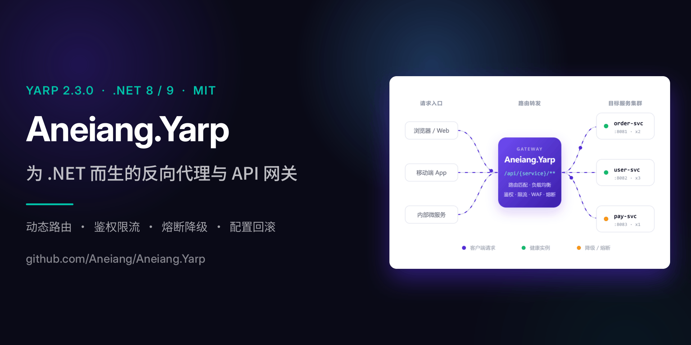

<div align="center">


<br/>


**Aneiang.Yarp — 基于 YARP 的全功能 API 网关**

插件体系 · Dashboard · 动态路由 · WAF 防火墙 · 服务发现 · AI 助手 · 2FA 验证 · IP 隔离

[](https://www.nuget.org/packages/Aneiang.Yarp)
[](https://www.nuget.org/packages/Aneiang.Yarp.Dashboard)
[](https://www.nuget.org/packages/Aneiang.Yarp.Client)
[](https://github.com/microsoft/reverse-proxy)
[](https://dotnet.microsoft.com/)
[](LICENSE)

[English](README.md) | [中文](README.zh-CN.md)

</div>

---

**Aneiang.Yarp** 是基于 [微软 YARP](https://microsoft.github.io/reverse-proxy/) 2.3.0 构建的生产级 API 网关。它开箱即用地提供了你原本需要自行搭建的全部能力：**插件化架构**（11 个内置插件）、可视化**管理面板**、WAF 防火墙、AI 智能助手、多 Provider **服务发现**、通知告警、健康检查与熔断监控，以及微服务**一行代码自动注册**。

[📖 文档](https://yarp.aneiang.com/docs/index.html#overview) · [🚀 在线演示](https://yarp-test.aneiang.com/aneiang) `admin` / `demo123` 

---

## Aneiang.Yarp 与裸 YARP 对比

| 需求 | 裸 YARP | Aneiang.Yarp |
|:-----|:----------|:-------------|
| 管理界面 | 自行搭建 | ✅ 内置 |
| 运行时编辑配置 | 仅支持重载文件 | ✅ 增删改查 + 表单/JSON 编辑 + 回滚 + 审计 |
| 安全防护（WAF） | 无 | ✅ WAF 插件（IP 黑白名单、SQLi、XSS、路径遍历） |
| 微服务注册 | 无 | ✅ 一行代码 REST/gRPC + 心跳自愈 |
| 可观测性 | 仅日志 | ✅ 指标、请求日志、健康检查、熔断面板 |
| 服务发现 | 手动维护集群 | ✅ Consul / Nacos / Eureka / K8s / HTTP-JSON / Static |
| AI 助手 | 无 | ✅ 对话式管理（40 个工具，读写分离） |
| 扩展性 | 自定义中间件 | ✅ 即插即用的 `IGatewayPlugin` 插件框架 |

---

## 系统架构

```
                   +-----------------------------------------------------------+
                   |                  Aneiang.Yarp 网关（YARP 2.3.0）              |
 +-------------+   |   +------------------+  +-------------------------------+  |
 |  5+ 个客户端  |   |   |  Web Dashboard   |  |  管理 API + gRPC 宿主             |  |
 |   浏览器/App  |   |   |  路由 / 插件       |  |  客户端自动注册                   |  |
 +-------------+   |   |  WAF / AI / 2FA   |  |                               |  |
                   |   +--------+----------+  +--------------+----------------+  |
                   |            +------------------------------------------------+ |
                   |            |                                                  |
                   |   +--------v---------+                                    | |
                   |   |  插件管道（11 个内置插件）                                    | |
                   |   |  WAF → 限流 → 重试 → 熔断 →            | |
                   |   |  压缩 → 缓存 → 指标 → 日志              | |
                   |   +--------+---------+                                    | |
                   |            +------------------------------------------------+ |
                   |            |                                                  |
                   |   +--------v---------+   +-------------------------------+  |
                   |   |  YARP 反向代理       | → |  目标服务 / 集群               |  |
                   |   |   动态路由         |   |  （通过服务发现）              |  |
                   |   +--------+---------+   +-------------------------------+  |
                   |            |
                   |   +--------v--------+
                   |   |  存储：SQLite（SQLCipher AES-256） |
                   +-----------------------------------------------------------+
```

---

## 项目亮点

- **插件化架构** —— 一切都是插件；11 个第一方插件提供 WAF、限流、重试、熔断、压缩、缓存、监控等能力。编写自己的 `IGatewayPlugin` 即可在几分钟内扩展网关。
- **可视化管理面板** —— 在一个界面统一管理集群、路由、插件、WAF、健康检查、熔断器、日志、通知、审计与配置历史。
- **运行时动态路由** —— 无需重启即可创建 / 编辑集群与路由，自动持久化并在重启后自动恢复。
- **原生 YARP 配置编辑** —— 表单 + JSON 双模编辑器，直接面向标准 YARP Schema。
- **多 Provider 服务发现** —— Consul、Nacos、Eureka、Kubernetes、HTTP-JSON、Static。
- **客户端一行注册** —— 微服务启动自动注册、关闭自动注销，支持 REST / gRPC + 心跳自愈。
- **AI 智能助手** —— 以对话方式管理网关；40 个 Function Calling 工具，读写权限严格分离。
- **灵活部署** —— `Auto` / `AllInOne` / `Split` / `ProxyOnly` / `DashboardOnly`，基于角色的端口路由。

---

## 快速开始

### 最小可用版

```bash
dotnet add package Aneiang.Yarp
dotnet add package Aneiang.Yarp.Dashboard
dotnet add package Aneiang.Yarp.Storage.Sqlite
```

```csharp
// Program.cs —— 网关
var builder = WebApplication.CreateBuilder(args);
builder.Services.AddAneiangYarp();
builder.Services.AddAneiangStorage();
builder.Services.AddAneiangYarpDashboard();

var app = builder.Build();
app.UseAneiangYarpDashboard();   // 内部已包含 MapReverseProxy
app.Run();
```

Dashboard 地址：`http://localhost:5000/apigateway`

**微服务** —— 启动自动注册，无需额外代码：

```bash
dotnet add package Aneiang.Yarp.Client
```

```csharp
builder.Services.AddAneiangYarpClient();
```

```json
{ "Gateway": { "Registration": { "GatewayUrl": "http://localhost:5000" } } }
```

### 推荐版（多端口 + gRPC + 热更新）

```csharp
var builder = WebApplication.CreateBuilder(args);
builder.UseYarpKestrelAutoConfig();           // 多端口 / gRPC 支持
builder.Services.AddAneiangYarp();
builder.Services.AddAneiangStorage();
builder.Services.AddAneiangYarpDashboard();
builder.Services.AddAneiangYarpDeployment();  // 部署模式 + 健康端点

var app = builder.Build();
app.UseAneiangYarpDashboard();
app.Run();
```

> 详细分步指南：[快速开始](https://yarp.aneiang.com/docs/index.html#quickstart)

---

## 包结构

| 包 | 用途 | 依赖 YARP |
|:----|:-----|:---:|
| **Aneiang.Yarp** | 网关核心：动态路由、IP 隔离、API 鉴权、插件执行 | ✅ |
| **Aneiang.Yarp.Dashboard** | Web 管理面板 + AI 助手 | 通过核心库 |
| **Aneiang.Yarp.Client** | 一行代码自动注册（无 YARP 依赖） | ❌ |
| **Aneiang.Yarp.Storage.Sqlite** | SQLite 存储（SQLCipher AES-256 加密） | 通过存储层 |
| **Aneiang.Yarp.Storage.Abstractions** | 存储接口与实体 | ❌ |
| **Aneiang.Yarp.Grpc** | gRPC 注册协议 | ❌ |
| **Aneiang.Yarp.Plugin.Abstractions** | 插件契约（`IGatewayPlugin`） | ❌ |
| **Aneiang.Yarp.Plugin.\*** | 11 个第一方插件，按需单独引入 | 通过核心库 |

**.NET 8.0 / 9.0**。

---

## 功能总览

| 领域 | 你能获得 | 详情 |
|:-----|:---------|:-----|
| **路由** | 动态集群与路由、拖拽排序优先级、表单/JSON 双编辑器、导入导出、快照回滚、审计 | [:link:](https://yarp.aneiang.com/docs/index.html#dynamic-routing) |
| **认证鉴权** | `None` / `DefaultJwt` / `CustomJwt` / `ApiKey` / 自定义委托；TOTP **2FA** | [:link:](https://yarp.aneiang.com/docs/index.html#authentication) |
| **安全防护** | WAF：IP 黑白名单、SQLi / XSS / 路径遍历检测、请求限制、安全响应头 | [:link:](https://yarp.aneiang.com/docs/index.html#waf-firewall) |
| **可观测性** | 请求日志（TraceID 配对、脱敏、采样）、WebSocket 实时流 | [:link:](https://yarp.aneiang.com/docs/index.html#request-logs) |
| **监控告警** | 请求/延迟/状态码指标（P50/P90/P99）、健康检查、熔断面板 | [:link:](https://yarp.aneiang.com/docs/index.html#health-check) |
| **通知** | Webhook 渠道（钉钉 / HTTP）、事件规则 + 冷却、发送历史 | [:link:](https://yarp.aneiang.com/docs/index.html#notifications) |
| **AI 助手** | 对话式管理、40 个工具、读写权限分离、流式输出、多服务商 | [:link:](https://yarp.aneiang.com/docs/index.html#ai-assistant) |
| **IP 隔离** | 按客户端 IP 将请求路由到指定开发者实例，便于协作调试 | [:link:](https://yarp.aneiang.com/docs/index.html#ip-isolation) |
| **客户端 SDK** | 自动注册/注销、心跳自愈、`GetServicesAsync` / `UpdateDestinationsAsync` | [:link:](https://yarp.aneiang.com/docs/index.html#client-registration) |
| **扩展性** | `IGatewayPlugin` 契约、插件中心管理、热重配的配置绑定 | [:link:](https://yarp.aneiang.com/docs/index.html#plugin-system) |
| **配置安全** | 自动快照、回滚、`GET /api/config/apply-errors`、SQLCipher 加密存储 | [:link:](https://yarp.aneiang.com/docs/index.html#config-history) |

---

## 服务发现

`ServiceDiscoveryRefreshService` 周期从注册中心解析集群目标端点并发布新的 YARP 快照 —— 全程无需重启。按集群绑定（`service-discovery` 插件绑定）。

| 模式 | 说明 |
|:-----|:-----|
| `Static` | 固定端点列表 |
| `HttpJson` | 返回 JSON 端点列表的通用 HTTP 端点 |
| `Consul` | 健康实例过滤 |
| `Nacos` | `healthyOnly` 过滤 + `hosts` 解析 |
| `Eureka` | JSON + `port.$` 解析 + `UP` 过滤 |
| `Kubernetes` | ServiceAccount token + endpoints subsets 解析 |

配置项：`Mode`（默认 `Static`）、`Endpoint`、`ServiceName`、`Namespace`（`default`）、`Scheme`（`http`）、`RefreshSeconds`（`30`）、`RequestTimeoutSeconds`（`5`）。

---

## 内置插件

| ID | 作用域 | 功能 |
|:---|:---|:-----|
| `waf` | Route | IP 黑白名单、SQLi / XSS / 路径遍历检测、请求限制、安全响应头 |
| `rate-limit` | Route | 固定窗口 / 滑动窗口 / 令牌桶 / 并发 |
| `rate-limit-redis` | Route | 基于 Redis Lua 的分布式限流；429 附带 `Retry-After` / `X-RateLimit-*` |
| `request-retry` | Route | 指数退避 + 抖动重试，状态码 / 异常策略 |
| `circuit-breaker` | Cluster | 失败阈值、恢复超时、半开探测 |
| `compression` | Route | 按 MIME 白名单 + 最小尺寸的 Gzip / Brotli 压缩 |
| `response-cache` | Route | 有界内存缓存，TTL 与 Vary 键 |
| `traffic-metrics` | Route | 按路由的请求 / 错误 / 延迟 / 字节 |
| `cluster-metrics` | Cluster | 按集群的请求 / 错误 / 延迟 / 目标节点 |
| `proxy-log` | Route | 全量代理捕获（头 / 可选 Body）、采样 |
| `service-discovery` | Cluster | 周期注册中心端点刷新 |

---

## 文档中心

完整文档位于 **[yarp.aneiang.com](https://yarp.aneiang.com)**。

- **快速入门** — [项目概览](https://yarp.aneiang.com/docs/index.html#overview) · [快速开始](https://yarp.aneiang.com/docs/index.html#quickstart)
- **核心网关** — [认证鉴权](https://yarp.aneiang.com/docs/index.html#authentication) · [动态路由](https://yarp.aneiang.com/docs/index.html#dynamic-routing) · [IP 隔离](https://yarp.aneiang.com/docs/index.html#ip-isolation) · [配置参考](https://yarp.aneiang.com/docs/index.html#configuration)
- **Dashboard** — [Dashboard 总览](https://yarp.aneiang.com/docs/index.html#dashboard-overview) · [配置历史](https://yarp.aneiang.com/docs/index.html#config-history)
- **安全防护** — [WAF 防火墙](https://yarp.aneiang.com/docs/index.html#waf-firewall) · [策略管理](https://yarp.aneiang.com/docs/index.html#policy-management)
- **监控告警** — [健康检查](https://yarp.aneiang.com/docs/index.html#health-check) · [熔断器](https://yarp.aneiang.com/docs/index.html#circuit-breaker) · [限流](https://yarp.aneiang.com/docs/index.html#rate-limiting) · [请求日志](https://yarp.aneiang.com/docs/index.html#request-logs) · [请求重试](https://yarp.aneiang.com/docs/index.html#request-retry) · [通知](https://yarp.aneiang.com/docs/index.html#notifications)
- **插件与管道** — [插件系统](https://yarp.aneiang.com/docs/index.html#plugin-system) · [中间件管道](https://yarp.aneiang.com/docs/index.html#middleware-pipeline)
- **客户端 SDK** — [客户端自动注册](https://yarp.aneiang.com/docs/index.html#client-registration)
- **AI 助手** — [AI 智能助手](https://yarp.aneiang.com/docs/index.html#ai-assistant)
- **高级用法** — [部署模式](https://yarp.aneiang.com/docs/index.html#deployment-modes) · [自定义认证](https://yarp.aneiang.com/docs/index.html#custom-auth) · [生产环境配置](https://yarp.aneiang.com/docs/index.html#production-config)
- **存储层** — [SQLite 存储](https://yarp.aneiang.com/docs/index.html#storage-sqlite)

---

## 贡献规范

欢迎任何人参与贡献！

1. Fork 本仓库并创建功能分支（`git checkout -b feature/your-feature`）。
2. 提交时使用清晰的提交信息，说明改动内容与目的。
3. 保持 **API 接口稳定** —— 新功能尽量以插件形式提供。
4. 新增插件请遵循 `IGatewayPlugin` 清单约定（ID、显示名、版本、作用域、能力），并提供 JSON Schema。
5. 修改 Dashboard 文案时，同步更新 `zh-CN` 与 `en-US` 两套语言包。
6. 提交 Pull Request 前请完整编译，确保 **0 警告 / 0 错误**。

请通过 GitHub Issues 反馈 Bug 与功能建议。所有第一方包均采用 MIT 许可。

---

## NuGet

| 包 | NuGet |
|:--------|:-----:|
| **Aneiang.Yarp** | [](https://www.nuget.org/packages/Aneiang.Yarp) |
| **Aneiang.Yarp.Dashboard** | [](https://www.nuget.org/packages/Aneiang.Yarp.Dashboard) |
| **Aneiang.Yarp.Client** | [](https://www.nuget.org/packages/Aneiang.Yarp.Client) |
| **Aneiang.Yarp.Storage.Abstractions** | [](https://www.nuget.org/packages/Aneiang.Yarp.Storage.Abstractions) |
| **Aneiang.Yarp.Storage.Sqlite** | [](https://www.nuget.org/packages/Aneiang.Yarp.Storage.Sqlite) |
| **Aneiang.Yarp.Grpc** | [](https://www.nuget.org/packages/Aneiang.Yarp.Grpc) |
| **Aneiang.Yarp.Plugin.Abstractions** | [](https://www.nuget.org/packages/Aneiang.Yarp.Plugin.Abstractions) |

**.NET 8.0 / 9.0** · **YARP 2.3.0**

---

## 许可证

[MIT](LICENSE)

---

<div align="center" style="display: flex; justify-content: center; align-items: center; gap: 20px;
            background: #f6f8fa; padding: 20px 30px; border-radius: 12px;
            border: 1px solid #e1e4e8; box-shadow: 0 2px 8px rgba(0,0,0,0.05);">
  
  <div style="text-align: left;">
    <h3 style="margin: 0 0 4px 0; font-size: 22px; font-weight: 600; color: #24292e;">
      递归不爆炸
    </h3>
    <p style="margin: 0; font-size: 16px; color: #586069; max-width: 280px;">
      扫码关注，获取更多精彩内容
    </p>
  </div>
</div>

<div align="center">

觉得有用？[⭐ Star 一下](https://github.com/aneiang/Aneiang.Yarp) 支持项目发展

</div>